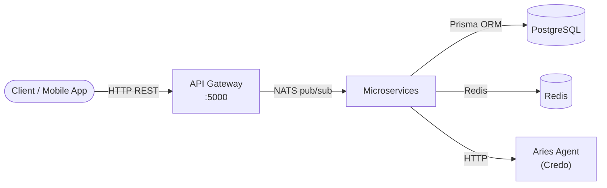
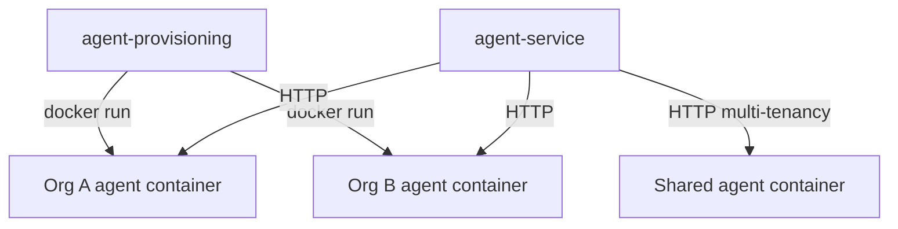

## Overview

CREDEBL is a **NestJS monorepo** structured as a collection of independent microservices. Every service connects to a shared [NATS](https://nats.io) message broker and communicates exclusively via typed message patterns — there are no direct HTTP calls between services. Clients interact only with the **API Gateway**, which translates inbound HTTP requests into NATS messages and returns the responses.

The repository lives under `apps/` for runnable services and `libs/` for shared libraries (Prisma client, common constants, logging, enumerations, etc.).

## Request flow

1. **Client** sends an HTTP request to the API Gateway on port `5000`.
2. **API Gateway** authenticates the request (JWT via Passport), validates the body, and publishes a NATS message to the responsible microservice subject.
3. The **target microservice** handles the business logic, reads or writes to PostgreSQL via Prisma, optionally reads from Redis cache, then publishes the response back through NATS.
4. The **API Gateway** receives the response and returns the HTTP reply to the client.

<Info>
  The API Gateway also connects to NATS as a microservice itself
  (`api-gateway` subject) so it can receive webhook callbacks and push
  notifications from downstream services.
</Info>

## Infrastructure dependencies

| Component | Role | Default port |
|-----------|------|-------------|
| **PostgreSQL 16** | Primary relational store. All services share one database accessed via Prisma ORM. | `5432` |
| **NATS** | Message broker for all inter-service communication. Services subscribe to named subjects defined in `CommonConstants`. | `4222` |
| **Redis 6.2** | Shared cache (API keys, session tokens) and Bull queue backend for bulk issuance jobs. | `6379` |

## Microservices

<CardGroup cols={2}>
  <Card title="api-gateway" icon="globe">
    The single HTTP entry point. Exposes a versioned REST API (URI versioning, default `v1`) and a Swagger UI at `/api`. Handles authentication, request validation, CORS, and rate limiting. Connects to every downstream service via NATS.
  </Card>
  <Card title="user" icon="user">
    Manages user registration, email verification, authentication (JWT / Keycloak / Supabase), password reset, and user profiles. Also tracks user activity and maintains org-level role assignments.
  </Card>
  <Card title="organization" icon="building">
    Creates and manages organizations, membership invitations, and role-based access control. Organizations are the top-level tenants in the platform — all credentials and connections belong to an organization.
  </Card>
  <Card title="connection" icon="link">
    Manages DIDComm connections between organizations and their credential holders. Handles out-of-band invitations, legacy and modern OOB invitation formats, and connection metadata.
  </Card>
  <Card title="issuance" icon="id-card">
    Issues verifiable credentials (AnonCreds and W3C VC) to connected holders, via both DIDComm and email (out-of-band). Supports bulk issuance with configurable batch sizes (up to 2,000 records per batch via Bull queues).
  </Card>
  <Card title="verification" icon="shield-check">
    Sends proof requests and verifies credential presentations from holders. Supports both DIDComm-based and out-of-band proof requests.
  </Card>
  <Card title="ledger" icon="database">
    Manages interactions with Hyperledger Indy ledgers (Bcovrin Testnet, Indicio Testnet/Demonet/Mainnet). Handles DID registration, NYM transactions, TAA acceptance, and endorser workflows.
  </Card>
  <Card title="agent-provisioning" icon="server">
    Spins up a dedicated Hyperledger Aries (Credo) agent Docker container for each organization. Manages agent configuration files under `apps/agent-provisioning/AFJ/agent-config/` and mounts the Docker socket to create sibling containers.
  </Card>
  <Card title="agent-service" icon="robot">
    Broker between the platform and live Aries agents. On startup it provisions the platform admin agent wallet, then routes all agent API calls (credential offers, proof requests, DID creation, ledger writes) to the correct dedicated or shared agent.
  </Card>
  <Card title="cloud-wallet" icon="wallet">
    Provides a managed cloud wallet for holders who do not run a mobile wallet. Holders can receive, store, and present credentials entirely through the API.
  </Card>
  <Card title="ecosystem" icon="network-wired">
    Manages trust ecosystems — multi-party governance frameworks where an Ecosystem Lead defines schemas and rules that Ecosystem Members follow. Supports endorser role assignment and transaction co-signing.
  </Card>
  <Card title="notification" icon="bell">
    Sends platform notifications (email via SendGrid, Resend, SMTP, or AWS SES; push via Firebase) to users when credential offers, proof requests, or connection invitations are received.
  </Card>
  <Card title="webhook" icon="webhook">
    Forwards agent webhook events (connection updates, credential state changes, proof state changes) to organization-registered webhook URLs.
  </Card>
  <Card title="utility" icon="wrench">
    Shared utility functions used by other services — schema file serving, QR code generation, PDF export, and CSV processing for bulk operations.
  </Card>
  <Card title="geo-location" icon="map-pin">
    Resolves geographic location metadata used for audit logging and access control policies.
  </Card>
  <Card title="x509" icon="certificate">
    Creates, imports, and decodes X.509 certificates used for trust registries and OID4VC credential signing. Marked experimental; hidden from Swagger by default.
  </Card>
  <Card title="oid4vc-issuance" icon="arrow-up-from-bracket">
    Implements the OpenID for Verifiable Credential Issuance (OID4VCI) specification. Creates issuers and credential offer sessions compatible with standards-based wallet clients. Marked experimental.
  </Card>
  <Card title="oid4vc-verification" icon="arrow-down-to-bracket">
    Implements OpenID for Verifiable Presentations (OID4VP). Creates verifier sessions and verifies authorization responses from holder wallets. Marked experimental.
  </Card>
</CardGroup>

## Agent layer

Each organization that issues or verifies credentials needs a running **Hyperledger Aries agent** (powered by [Credo](https://hyperledger.github.io/aries/)). CREDEBL supports two agent topologies:

**Dedicated agent** — the `agent-provisioning` service spins up a separate Docker container for each organization. The container mounts a per-org configuration directory and exposes an HTTP API that `agent-service` proxies. Each agent maintains its own wallet and DID.

**Shared (multi-tenant) agent** — a single Credo agent running in multi-tenancy mode. Each organization gets a sub-wallet (tenant) within that agent, identified by a tenant token. This is lighter on resources and preferred for large deployments with many organizations.

<Note>
  `agent-service` on startup automatically provisions the platform admin wallet
  against the Bcovrin Testnet, Indicio Testnet, Indicio Demonet, and Indicio
  Mainnet ledgers, using the `ed25519` key type and `indy` DID method.
</Note>

## Shared libraries

The `libs/` directory contains packages shared across all microservices:

| Library | Purpose |
|---------|---------|
| `prisma-service` | Prisma schema, generated client, migrations, and seed data |
| `common` | NATS configuration helpers, shared constants (`CommonConstants`), exception filters, response message enums, and email utilities |
| `enum` | Shared TypeScript enums (ledger names, schema types, org roles) |
| `logger` | Structured Winston logger with ECS format and OpenTelemetry export |
| `org-roles` | Organization role enum and guards |
| `user-request` | Typed interface for the authenticated user object injected by the JWT guard |
| `config` | Environment-based configuration helpers |
| `context` | `AsyncLocalStorage`-based request context (used by `nestjs-cls`) |
| `aws` | AWS SDK helpers (S3, SES) |
| `keycloak-url` / `keycloak-config` | Keycloak OIDC integration helpers |
| `supabase` | Supabase Auth client helpers |
